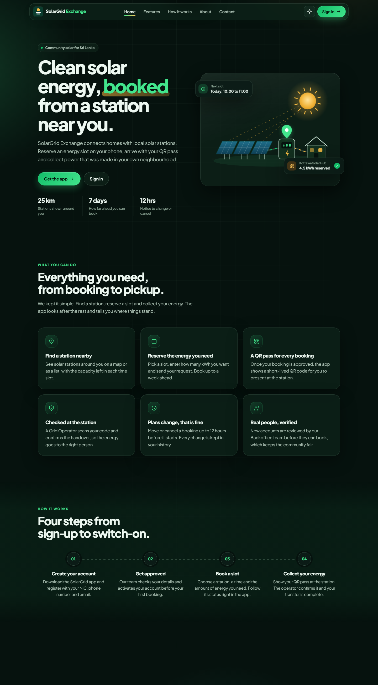
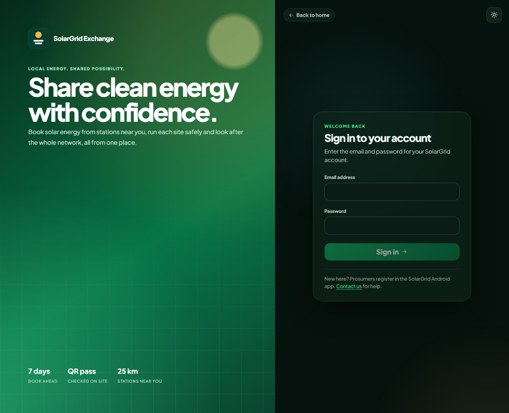
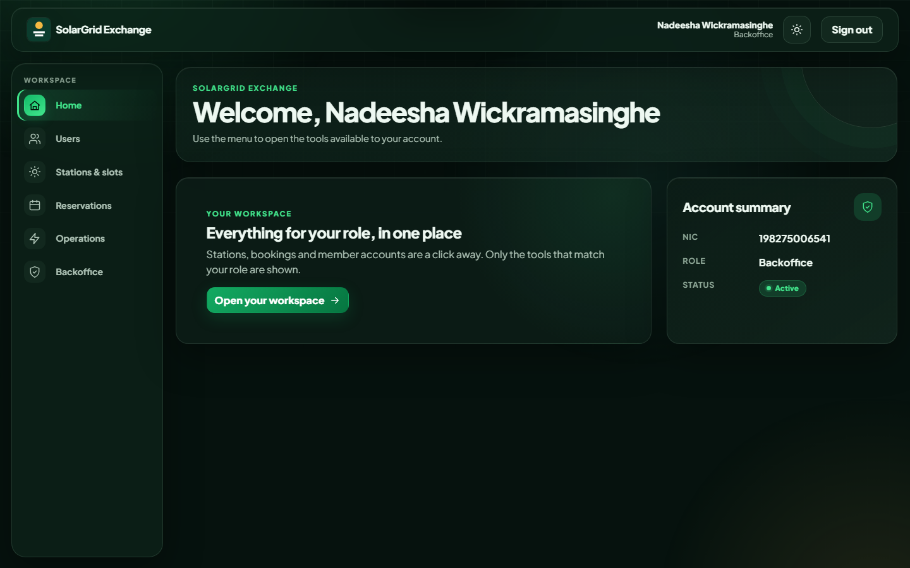
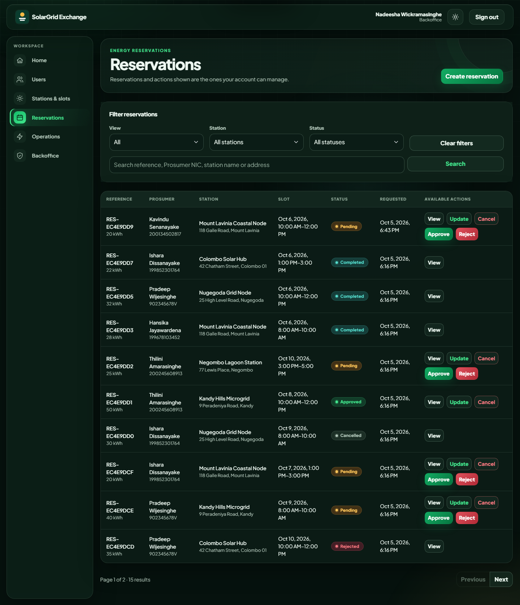
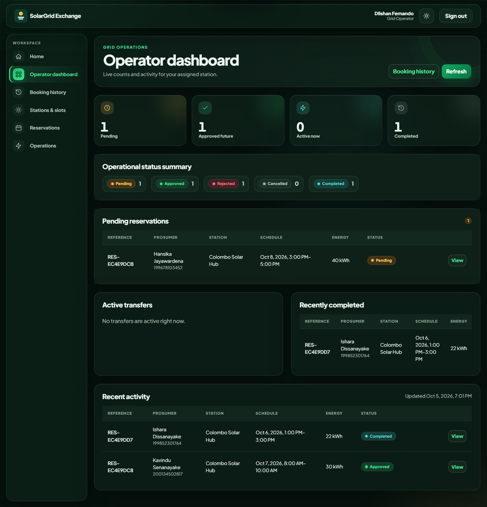
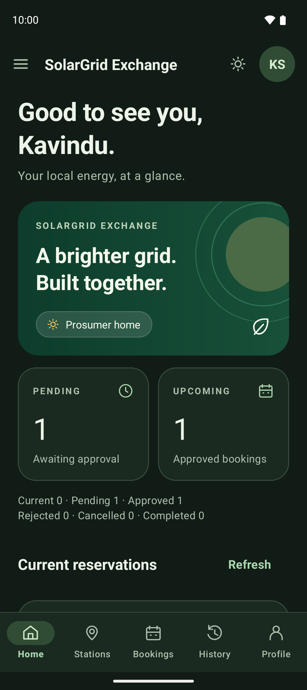
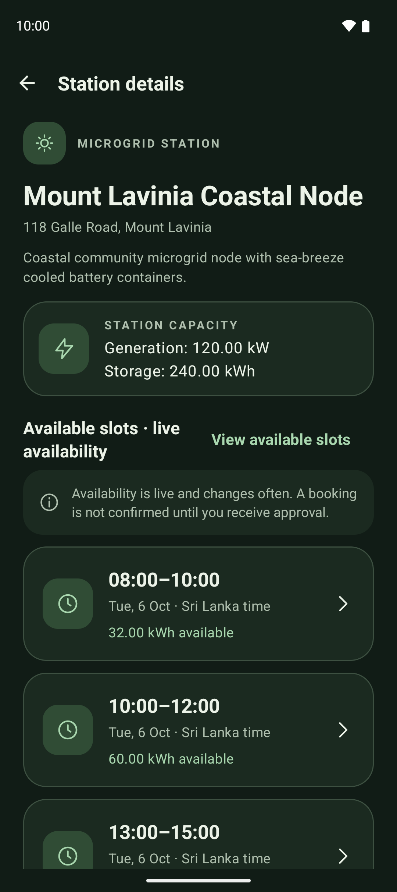
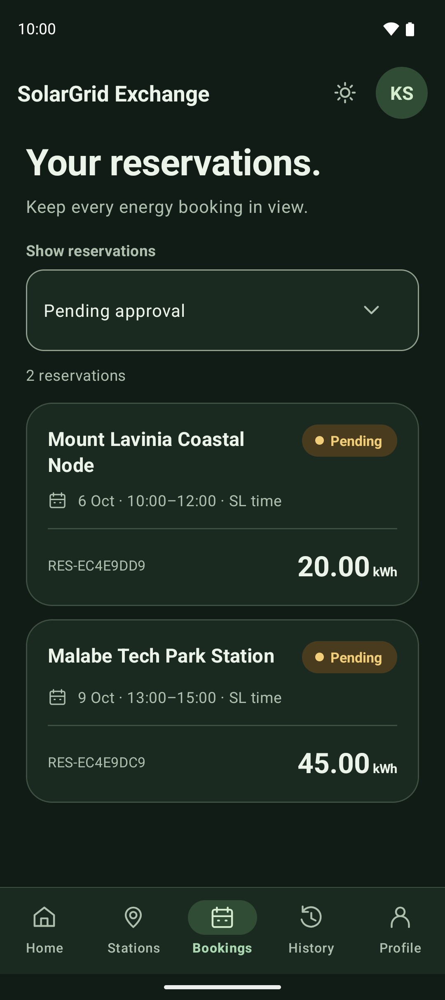
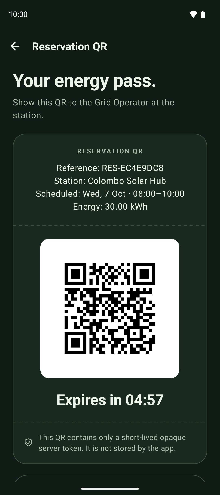
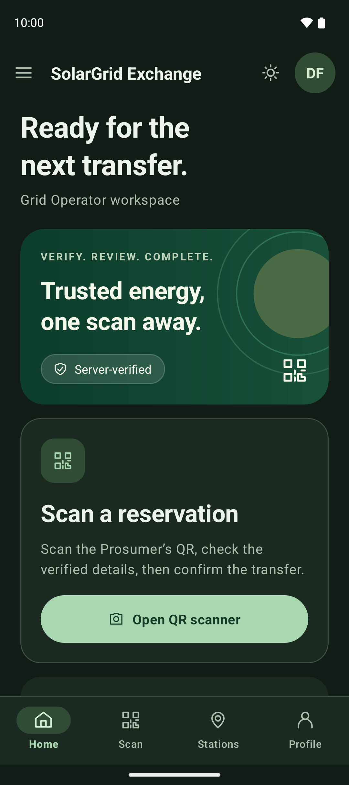

# SolarGrid-Exchange
SolarGrid Exchange: A Client–Server Smart Solar Microgrid Energy Trading and Reservation System

## Repository link

https://github.com/ChiranLK/SolarGrid-Exchange

## Demo video

Walkthrough of the web and Android apps (5 minutes or less): [Watch the demo video (OneDrive)](https://mysliit-my.sharepoint.com/:v:/g/personal/it23401976_my_sliit_lk/IQAt1BFpoLNzR6RHGsvHW2kEAbS_Ev1V9Km-_RUGBHPLlUE?nav=eyJyZWZlcnJhbEluZm8iOnsicmVmZXJyYWxBcHAiOiJPbmVEcml2ZUZvckJ1c2luZXNzIiwicmVmZXJyYWxBcHBQbGF0Zm9ybSI6IldlYiIsInJlZmVycmFsTW9kZSI6InZpZXciLCJyZWZlcnJhbFZpZXciOiJNeUZpbGVzTGlua0NvcHkifX0&e=Uag22c)

## Project overview

SolarGrid Exchange lets people who generate solar power (prosumers) reserve time slots at solar microgrid stations to trade energy. Backoffice staff manage users, stations, slots and reservation approvals. Grid operators verify a prosumer's secure QR code at the station and complete the energy transfer. One central Web API holds all the rules; the web app and the Android app are clients of it.

## Technologies

| Part | Technology |
| --- | --- |
| Web frontend | React 19, TypeScript, Vite, Bootstrap 5 |
| Mobile app | Native Android (Java 17, XML layouts, Fragments/ViewModels), SQLite for the signed-in session, CameraX + ML Kit for QR scanning, Google Maps |
| Backend | C# ASP.NET Core Web API (.NET 10), JWT authentication |
| Database | MongoDB (replica set) |
| Hosting | Windows Server + IIS |
| Tests | xUnit, Moq, Vitest, Android unit tests |

## Main features

- **User roles**: Backoffice, Grid Operator and Prosumer, with role-based access in the API and both apps.
- **Prosumer management**: registration by NIC, approval/activation, deactivation requests.
- **Grid nodes (stations)**: stations with location, generation capacity, battery storage, weekly operating schedule and bookable energy slots.
- **Bookings**: create, modify, cancel, approve and reject reservations, with capacity and scheduling rules enforced by the server.
- **QR scanning**: approved reservations show a short-lived secure QR; Grid Operators scan it, verify it and complete the transfer once.
- **Maps**: nearby stations on a map and in a list in the Android app.
- **Dashboards and history**: role-scoped dashboards and searchable booking history.

## Architecture

```text
 React web client (Bootstrap 5)      Native Android client (Java, XML, SQLite session)
            \                                   /
             \          HTTPS + JWT bearer     /
              v                               v
        ASP.NET Core Web API (.NET 10, controllers -> FAT services)
                              |
                              v
                MongoDB (replica set for transactions)
```

- **`SolarMicrogrid.API/`**: central ASP.NET Core Web API.
  - Thin controllers call scoped services that hold all business rules (FAT service pattern).
  - MongoDB through one `MongoDbContext`; indexes are created at startup.
  - JWT bearer authentication; shared `{ "status", "message" }` error responses.
- **`SolarMicrogrid.Web/`**: React 19 + TypeScript + Vite + Bootstrap 5.
  - A UI-only API client: one Fetch wrapper (`src/api/apiClient.ts`), no business rules and no database access.
- **`SolarGridAndroid/`**: pure-native Android (Java 17, AndroidX, XML layouts, Fragments/ViewModels).
  - One `HttpURLConnection` API client.
  - One app-private SQLite database for the signed-in session only; reservations are never cached.
- **Tests**: `SolarMicrogrid.API.Tests/` (xUnit, real MongoDB replica set) and `SolarMicrogrid.Tests/` (xUnit/Moq service tests).
- **`docs/`**: component contracts, progress logs, the IIS runbook and Member 4 audit material.

The API is the only authority for identity, roles, time, reservation state, counts, QR eligibility and completion. Clients display server responses.

## Roles

| Role | Main capabilities |
| --- | --- |
| `Backoffice` | User and prosumer management, station/slot management, reservation approval/rejection, global dashboard/history |
| `GridOperator` | Station-scoped dashboard and history, scan and verify Prosumer QR codes, complete verified energy transfers |
| `Prosumer` | Book/modify/cancel reservations, personal dashboard and history, display the QR for an approved reservation |

Role names are exact and case-sensitive in the JWT and in both clients.

## Prerequisites

- .NET SDK 10
- Node.js 22.12+ and npm
- MongoDB running as a replica set (needed for multi-document transactions). Docker Desktop is enough for local tests.
- Android Studio with Android SDK platform 36 and build tools, plus an emulator or device running API 24+
- Windows Server + IIS + .NET 10 Hosting Bundle for deployment

## Configuration

Tracked configuration contains **no secrets**. `JwtSettings:Key` and `MongoSettings:ConnectionString` are intentionally empty.

For local development, use .NET user secrets (the API project has a `UserSecretsId`):

```powershell
dotnet user-secrets --project SolarMicrogrid.API set "MongoSettings:ConnectionString" "<local-replica-set-connection-string>"
dotnet user-secrets --project SolarMicrogrid.API set "JwtSettings:Key" "<random-value-at-least-32-characters>"
```

For IIS, set them as environment variables (`MongoSettings__ConnectionString`, `JwtSettings__Key`). See [docs/deployment/iis-deployment.md](docs/deployment/iis-deployment.md) for the full list.

Never commit connection strings, JWT keys, tokens, QR values or real NIC data.

## Running locally

1. **API**:

   ```powershell
   dotnet restore SolarMicrogrid.slnx
   dotnet run --project SolarMicrogrid.API --launch-profile https
   ```

   - The API listens on `https://localhost:7168` and `http://localhost:5076`.
   - OpenAPI is enabled in Development at `/openapi/v1.json`.
   - Health is at `/health`.

2. **Web**:

   ```powershell
   cd SolarMicrogrid.Web
   npm ci
   npm run dev
   ```

   Open `http://localhost:5173`. Vite proxies `/api` to the API (see `.env.example`).

3. **Android**:
   1. Open `SolarGridAndroid` in Android Studio and let Gradle sync.
   2. Run the `app` configuration.
   3. The debug build calls `http://10.0.2.2:5076/api/`, the emulator's alias for the development machine. For a physical device, override the URL:

   ```powershell
   $env:SOLARGRID_API_BASE_URL = 'http://<lan-ip>:5076/api/'
   .\gradlew.bat assembleDebug
   ```

## Demo data

For a fresh database, create the first Backoffice account with the start-up bootstrap ([docs/member-1/backoffice-bootstrap.md](docs/member-1/backoffice-bootstrap.md)), then load the demo data through the running API. The script can be re-run safely and no passwords are stored in it.

```powershell
powershell.exe -NoProfile -ExecutionPolicy Bypass -File scripts\seed-demo-data.ps1 -BackofficeEmail "<first-backoffice-email>" -BackofficePassword "<its-password>" -DemoPassword "<password-for-all-other-demo-accounts>"
```

It loads data that matches the assignment brief for all three roles:

| Data | What is created |
| --- | --- |
| Stations | 7 stations across Sri Lanka with GPS location, generation capacity (kW), battery storage (kWh) and a weekly operating schedule; one station is deactivated |
| Energy slots | About 150 bookable slots for the next 6 days, respecting each station's opening hours; one slot is marked unavailable by an operator |
| Backoffice | 2 accounts (the bootstrap account plus one created through the user management endpoint) |
| Grid Operators | 4 accounts, each assigned to a station |
| Prosumers | 9 accounts identified by NIC: active, awaiting activation, deactivation requested and deactivated |
| Reservations | 14 reservations in every state: Pending, Approved, Rejected, Cancelled and Completed (through the real QR generate, verify and complete flow) |

Demo accounts use the email pattern `first.last@solargrid.example` (for example `dilshan.fernando@solargrid.example`, a Grid Operator for Colombo Solar Hub) with the `-DemoPassword` you chose.

## Tests

| Area | Command (from repository root unless noted) |
| --- | --- |
| Build | `dotnet build SolarMicrogrid.slnx --configuration Release --no-restore -m:1` |
| Service tests | `dotnet test SolarMicrogrid.Tests/SolarMicrogrid.Tests.csproj --configuration Release --no-build --no-restore` |
| API + MongoDB integration | `powershell.exe -NoProfile -ExecutionPolicy Bypass -File scripts\run-component3-tests.ps1` (starts and removes a disposable MongoDB 8 replica set in Docker) |
| Web lint, tests, build | `npm run check` in `SolarMicrogrid.Web` |
| Android Gradle | `.\gradlew.bat testDebugUnitTest assembleDebug lintDebug` in `SolarGridAndroid` (requires the Android SDK) |
| Android pure-Java supplemental | `powershell.exe -NoProfile -ExecutionPolicy Bypass -File scripts\run-member4-android-unit-tests.ps1` |
| Local deployment contract | `powershell.exe -NoProfile -ExecutionPolicy Bypass -File scripts\verify-member4-deployment.ps1` |

The latest recorded results are in [docs/member-4/final-audit.md](docs/member-4/final-audit.md).

## IIS deployment (summary)

1. Install IIS and the .NET 10 Hosting Bundle on the server.
2. Publish the API:

   ```powershell
   dotnet publish SolarMicrogrid.API/SolarMicrogrid.API.csproj -c Release -p:PublishProfile=IIS-Release
   ```

   Output goes to `artifacts\iis\api`, using ANCM v2 in-process with stdout logging off.
3. Create a dedicated app pool (No Managed Code) and site, bind a trusted HTTPS certificate, and restrict file permissions.
4. Set `ASPNETCORE_ENVIRONMENT=Production`, the MongoDB/JWT secrets and `Cors__AllowedOrigins__0` as environment variables.
5. Build the web client with `VITE_API_BASE_URL` (`/api` for same-origin). Build Android release with `SOLARGRID_API_BASE_URL=https://<api-host>/api/`.
6. Check `https://<api-host>/health` and run the smoke tests.

To publish and host the API on a prepared IIS server in one step, run from an elevated PowerShell (it also creates the app pool, site, environment values and firewall rule, then checks `/health`):

```powershell
powershell.exe -NoProfile -ExecutionPolicy Bypass -File scripts\deploy-iis.ps1 -MongoConnectionString "<connection-string>" -JwtKey "<random-value-at-least-32-characters>" -Port 8080 -Environment Development
```

`-Environment Development` is for a plain-HTTP lab or viva demo. For real production leave the default (`Production`), which requires an HTTPS binding with a trusted certificate and HTTPS CORS origins.

For the Android app, set `SOLARGRID_API_BASE_URL` in `SolarGridAndroid/local.properties` to the server address (`http://<server-ip>:8080/api/` for a lab server, `https://<api-host>/api/` for release).

The full runbook, including rollback and troubleshooting, is in [docs/deployment/iis-deployment.md](docs/deployment/iis-deployment.md).

## Individual contributions

| Member | IT number | Name | Component |
| --- | --- | --- | --- |
| Member 1 | IT23472020 | Maduwantha HAS | Authentication and Account Management |
| Member 2 | IT23401976 | Serasinghe CS | Solar Stations, Energy Slots and Maps |
| Member 3 | IT23405240 | Alahakoon PB | Reservation Workflow |
| Member 4 | IT23242272 | Nimadith LMH | Dashboard, QR Verification and Deployment |

Each member's individual commits are visible in the [commit history](https://github.com/ChiranLK/SolarGrid-Exchange/commits/main).

### Member 1 – IT23472020 – Authentication and Account Management (Maduwantha HAS)

Responsible for designing and implementing the system's authentication and account-management functionality. This includes MongoDB configuration, JWT-based authentication, role-based authorization, user and prosumer account management, login, profile management, account activation/reactivation, and deactivation requests. The member also develops the corresponding web-based administration interfaces and Android registration, login, profile, and session-management features.

### Member 2 – IT23401976 – Solar Stations, Energy Slots and Maps (Serasinghe CS)

Responsible for developing the solar-station and energy-slot management module. This includes implementing solar station information, GPS coordinates, capacity and battery details, operating schedules, station activation/deactivation, booking-slot management, and availability rules. The member also develops the web interfaces for station and slot administration and integrates Google Maps functionality into the Android application to display nearby stations, station markers, station details, and available energy slots.

### Member 3 – IT23405240 – Reservation Workflow (Alahakoon PB)

Responsible for designing and implementing the complete energy-reservation workflow. This includes reservation creation, modification, cancellation, availability validation, duplicate-booking prevention, slot release, reservation approval/rejection, and enforcement of the seven-day booking and twelve-hour modification/cancellation rules. The member also develops the web-based reservation management functions and Android reservation features, including slot selection, booking, reservation summaries, modification, cancellation, and status handling.

### Member 4 – IT23242272 – Dashboard, QR Verification and Deployment (Nimadith LMH)

Responsible for developing the operational dashboards, transaction management, QR-based verification, and deployment-related functionality. This includes dashboard statistics, reservation history, search and filtering, QR transaction data, server-side QR verification, energy-transfer completion, and prevention of duplicate transaction completion. The member also develops the Grid Operator dashboard and Android QR-generation/scanning functionality. In addition, the member contributes to IIS deployment, CORS configuration, OpenAPI verification, end-to-end integration testing, README consolidation, and overall system integration.

#### Member 4 technical details

- **API**:
  - `GET /api/dashboard` and `GET /api/dashboard/history`: role-scoped counts, current/pending/approved-future lists, and history with search/status/station/date filters and stable paging.
  - `POST /api/transactions/reservations/{id}/qr`, `POST /api/transactions/verify` and `POST /api/transactions/reservations/{id}/complete`:
    - opaque 256-bit tokens with hash-only storage and a five-minute expiry;
    - assigned-station verification;
    - atomic one-time completion with replay prevention.
- **Web**: Grid Operator dashboard (`/operator/dashboard`) and booking history (`/operator/history`).
- **Android**:
  - Prosumer dashboard, booking history and QR display.
  - Grid Operator CameraX/ML Kit scanner, verification, confirmation and completion screens.
- **Deployment**: bounded `/health`, validated CORS, OpenAPI with bearer security, correlation IDs, safe error logging, IIS publish profile and runbook, and removal of a previously tracked JWT key.
- **Documentation**: [contracts](docs/member-4/contracts.md), [progress](docs/member-4/progress.md), [test evidence](docs/member-4/test-evidence.md), [final audit](docs/member-4/final-audit.md), [screenshot checklist](docs/member-4/screenshot-checklist.md), [video script](docs/member-4/video-script.md), [viva notes](docs/member-4/viva-notes.md).

## Troubleshooting

- **API fails at startup with a configuration error**: the JWT key or MongoDB connection string is missing. Set them through user secrets or environment variables.
- **Transaction/completion errors or integration tests fail to start**: MongoDB must be a replica set. Check that Docker is running for the test script.
- **PowerShell refuses to run a script**: use `powershell.exe -NoProfile -ExecutionPolicy Bypass -File <script>` as shown above.
- **Browser CORS error**: the web origin must exactly match an entry in `Cors:AllowedOrigins` (scheme, host and port, no path or wildcard).
- **Android `SDK location not found`**: set `ANDROID_HOME` or create `SolarGridAndroid/local.properties` with `sdk.dir=...` (do not commit it).
- **Android cannot reach the API**: `10.0.2.2` works only from the emulator. Use a LAN IP for a device and a hosted HTTPS URL for release builds.
- **401 after some time**: the JWT expired (60 minutes by default). Sign in again.
- **403 on verify**: the Grid Operator's assigned station does not match the reservation's station.
- **409 on verify/complete**: the QR was already used, expired, or the reservation changed. Ask the Prosumer to reopen the QR.
- **IIS 500.30 / 502.5**: check that the .NET 10 Hosting Bundle is installed and see the runbook troubleshooting section.

## Application screenshots

Main screens of the web and Android apps.

### Web

| Landing page | Sign in |
| --- | --- |
|  |  |

| Backoffice home | Backoffice reservations |
| --- | --- |
|  |  |

| Grid Operator slot monitoring |
| --- |
|  |

### Android

| Prosumer home | Station details | My bookings | Secure QR | Grid Operator home |
| --- | --- | --- | --- | --- |
|  |  |  |  |  |
